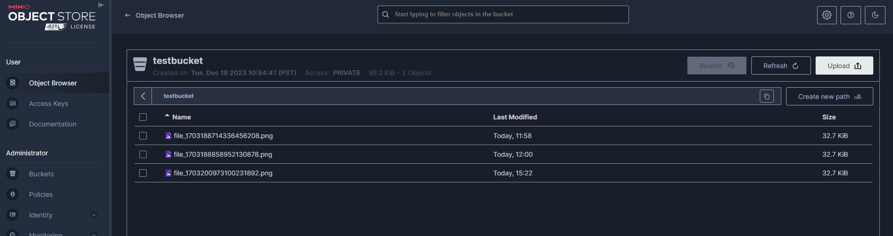

# upload-to-minio

## Getting started 
This simple go microservice exposes an `upload` endpoint to upload a file to minio. 

## Deploying Minio
Official documentation on how to deploy minio is [here](https://min.io/docs/minio/kubernetes/upstream/operations/install-deploy-manage/deploy-operator-helm.html). 
For the impatient here's a quick start: `kubectl apply -f k8s/minio.yaml`
This would create a namespace called `minio` and deploy minio in it. The service can be accessed on port 9000. 

The default credentials are set as `minio` and `minio123`. Once Minio is up and running we can create a bucket and upload a file to it using the `go client` 

## To run the go microservice:
`go run main.go` 

This can also be deployed as a container to the k8s cluster. 

If run locally it can be accessible on port# 8080. Let's do a health check: `http://localhost:8080/ping`
```
$ curl http://localhost:8080/ping
{"message": "Yooh, I am alive responding pong!!"}
```

So, good. Now let's upload a file to minio. We'll use the go client to do this:
```
$ curl http://localhost:8080/upload -F 'file=@k8s.png' -vv
*   Trying [::1]:8080...
* Connected to localhost (::1) port 8080
> POST /upload HTTP/1.1
> Host: localhost:8080
> User-Agent: curl/8.4.0
> Accept: */*
> Content-Length: 33718
> Content-Type: multipart/form-data; boundary=------------------------reN4am6EJmf7mE4lujmxA4
>
* We are completely uploaded and fine
< HTTP/1.1 200 OK
< Date: Thu, 21 Dec 2023 23:22:53 GMT
< Content-Length: 0
<
* Connection #0 to host localhost left intact
```

_Note: `file` is the file's  name in the form data. `k8s.png` is the file we're uploading. It's important that `file` and `r.FormFile("file")` in `go` should match_

If everything worked as expected, the go client would have uploaded the file to Minio. Let's verify this from the go app log as well, 
```
2023/12/21 15:20:24 We already own testbucket
File type is png
2023/12/21 15:22:53 File saved to file_1703200973100231892.png
2023/12/21 15:22:53 Uploading file to minio
2023/12/21 15:22:53 Successfully uploaded file_1703200973100231892.png of size 32 KB
```


Let's check if the file is present in the bucket: 



The go-app can also be deployed on Kubernetes, take a look at [upload-to-minio.yaml](k8s/upload-to-minio.yaml).
This will get deployed on the same namespace `minio` so the app can talk to minio directly using the service name. Also, make changes to the service type if needed, the default is LoadBalancer
```
k apply -f k8s/upload-to-minio.yaml 
deployment.apps/upload-to-minio unchanged
service/upload-to-minio-svc created
```

Now you can try uploading to minio using the go-apps Loadbalancer IP
```
$ curl http://10.xx.1xx.xx:8080/upload -F 'file=@teams_error.png' -vv
*   Trying 10.xx.1xx.xx:8080...
* Connected to 10.xx.1xx.xx (10.xx.1xx.xx) port 8080
> POST /upload HTTP/1.1
> Host: 10.xx.1xx.xx:8080
> User-Agent: curl/8.4.0
> Accept: */*
> Content-Length: 84956
> Content-Type: multipart/form-data; boundary=------------------------QGIGjSC2igQc9JpCkj65MV
>
* We are completely uploaded and fine
< HTTP/1.1 200 OK
< Date: Fri, 22 Dec 2023 00:41:53 GMT
< Content-Length: 0
<
* Connection #0 to host 10.xx.1xx.xx left intact
```
